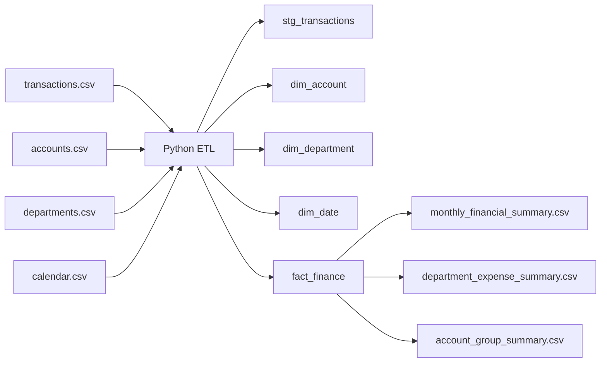

# Financial ETL Reporting OLAP

This project is my public-safe version of the kind of financial ETL and reporting work I mentioned in my resume.

It is not a copy of a real company system, but it is based on the same type of problem: taking raw finance transactions, organizing them into something more structured, and making them usable for monthly reporting.

I wanted this repo to feel closer to actual BI work than a very small demo script, so I kept the idea simple but tried to make the flow realistic.

## Why I made this project

In my resume, I mention work with:

- SQL and ETL workflows
- SSIS and SSAS
- OLAP-style reporting
- financial reporting pipelines
- business intelligence for decision support

So this repository is my way of showing that part of my background in a portfolio format.

## Project timeline

Portfolio reconstruction of financial BI and ETL work from 2024.

## Business scenario

A trading company has transaction data across different departments and account groups. The data exists, but it is not really in a shape that management can use directly.

Usually they want fast answers to questions like:

- monthly revenue
- operating expenses
- gross profit
- department-level spending
- account-group level trends

So the main idea here was to build a small reporting mart that could support that kind of analysis.

The ETL flow in this project does a few practical things:

- clean transaction records
- map accounts to reporting categories
- integrate department and date dimensions
- build a fact table for reporting
- calculate monthly management KPIs

## Architecture



## Project structure

```text
financial-etl-reporting-olap/
|-- data/
|   `-- raw/
|       |-- accounts.csv
|       |-- calendar.csv
|       |-- departments.csv
|       `-- transactions.csv
|-- docs/
|   |-- data_model.md
|   |-- kpi_definitions.md
|   `-- reporting_notes.md
|-- output/
|   |-- account_group_summary.csv
|   |-- department_expense_summary.csv
|   `-- monthly_financial_summary.csv
|-- sql/
|   `-- create_finance_tables.sql
|-- src/
|   `-- run_financial_etl.py
|-- .gitignore
|-- README.md
`-- requirements.txt
```

## How to run

From this folder, run:

```powershell
python -m venv .venv
.venv\Scripts\Activate.ps1
pip install -r requirements.txt
python src\run_financial_etl.py
```

## Outputs

The pipeline creates:

- a cleaned finance fact table
- monthly financial summaries
- department expense summaries
- account group summaries

The most useful output is probably the monthly summary, because it gives a simple reporting view of revenue, COGS, OPEX, gross profit, and operating profit.

## What this project shows

- financial data ETL
- reporting mart design
- star-schema thinking
- KPI definition for management reporting
- business-aligned data modeling

## Notes

This project is intentionally a portfolio reconstruction, so the data is sample data and the business logic is simplified.

Still, the structure is close to the kind of work I wanted to represent:

- raw data coming from operations
- ETL and mapping logic
- a reporting-friendly model
- outputs that a dashboard or management report could use

## Next improvements

- add budget vs actual analysis
- recreate the reporting mart in SQL Server
- add OLAP cube-style hierarchies
- create Power BI finance dashboards on top of the outputs
