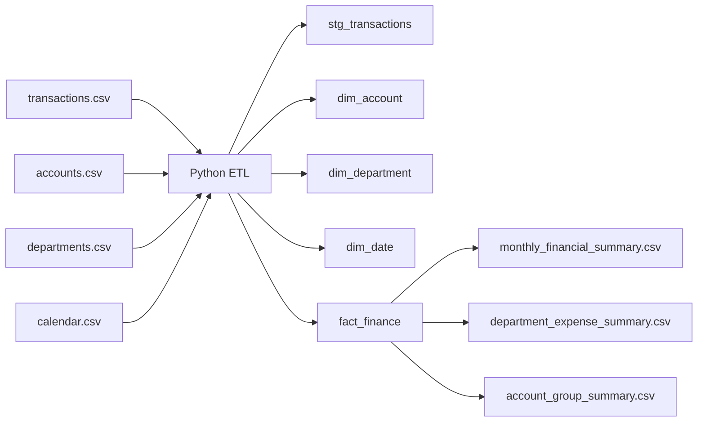

# Financial ETL Reporting OLAP

This repository is a public portfolio reconstruction of the type of financial ETL and reporting work described in my resume. It simulates how transaction data can be integrated into a finance reporting mart for monthly KPI analysis and management reporting.

## Why this project fits my profile

My resume includes experience with:

- SQL and ETL workflows
- SSIS and SSAS
- OLAP-style reporting
- financial reporting pipelines
- business intelligence for decision support

This project is designed to reflect that background with a more complex and realistic reporting case study.

## Project timeline

Portfolio reconstruction of financial BI and ETL work from 2024.

## Business scenario

A trading company records financial transactions across multiple departments and account groups. Management needs a reliable reporting layer to monitor:

- monthly revenue
- operating expenses
- gross profit
- department-level spending
- account-group level trends

The raw accounting data is not directly ready for analytics, so the ETL pipeline must:

- clean transaction records
- map accounts to reporting categories
- integrate department and date dimensions
- build a fact table for reporting
- calculate monthly management KPIs

## Architecture



## Project structure

```text
financial-etl-reporting-olap/
|-- data/
|   `-- raw/
|       |-- accounts.csv
|       |-- calendar.csv
|       |-- departments.csv
|       `-- transactions.csv
|-- docs/
|   |-- data_model.md
|   |-- kpi_definitions.md
|   `-- reporting_notes.md
|-- output/
|   |-- account_group_summary.csv
|   |-- department_expense_summary.csv
|   `-- monthly_financial_summary.csv
|-- sql/
|   `-- create_finance_tables.sql
|-- src/
|   `-- run_financial_etl.py
|-- .gitignore
|-- README.md
`-- requirements.txt
```

## How to run

From this folder:

```powershell
python -m venv .venv
.venv\Scripts\Activate.ps1
pip install -r requirements.txt
python src\run_financial_etl.py
```

## Outputs

The pipeline generates:

- a cleaned finance fact table
- monthly financial summaries
- department expense summaries
- account group summaries

## Skills demonstrated

- financial data ETL
- reporting mart design
- star-schema thinking
- KPI definition for management reporting
- business-aligned data modeling

## Next improvements

- add budget vs actual analysis
- recreate the reporting mart in SQL Server
- add OLAP cube-style hierarchies
- create Power BI finance dashboards on top of the outputs

